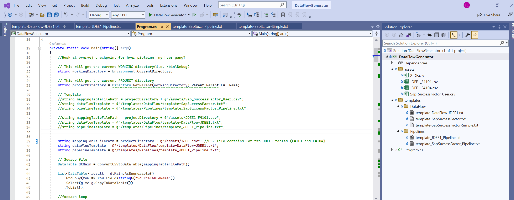
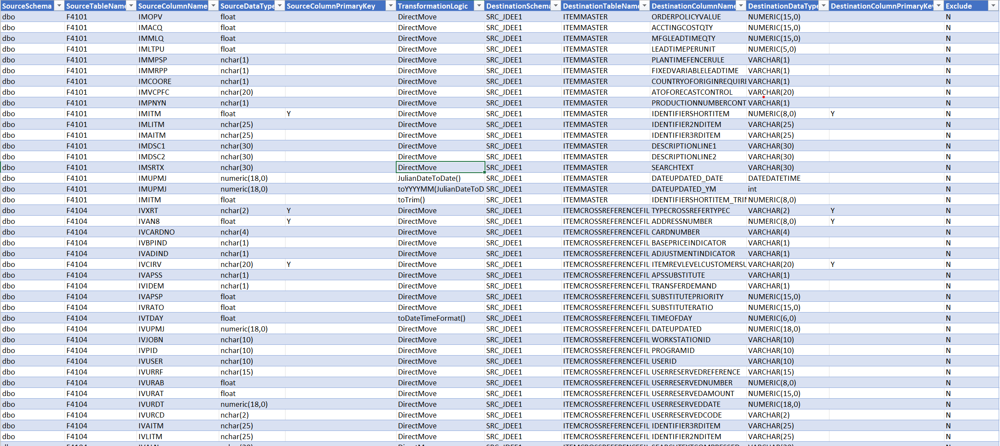
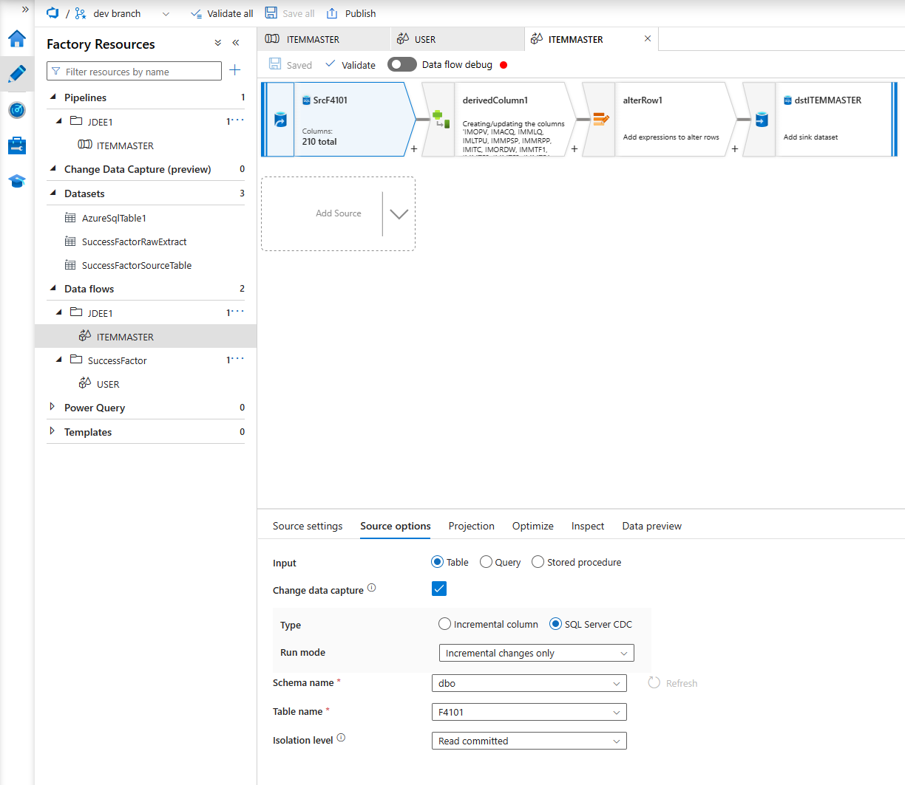
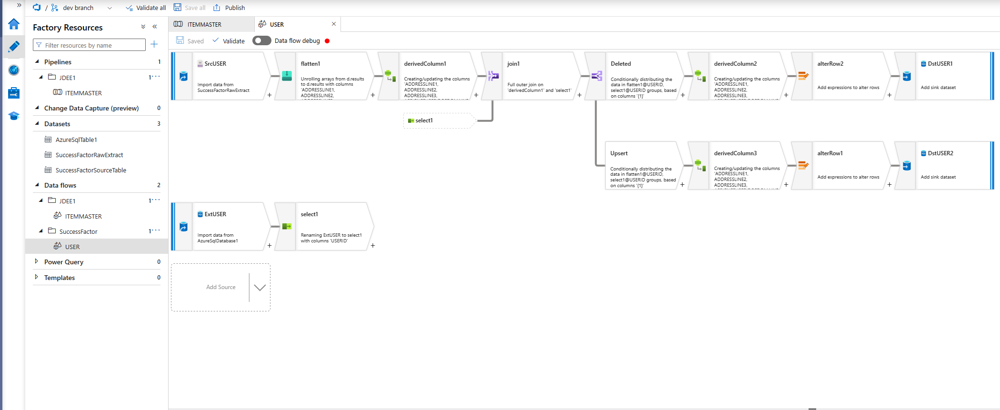

# Azure Data Factory Data Flow And Pipeline Generator
This repository contains a demo on how to generate a pipeline and dataflow using a C# console application.

## Prerequisite:
- Access to a Azure SQL Databasse
- Access to a Azure Storage Account (optional)
- Access to a new Azure Data Factory instance connected to either Git or Azure DevOps
- Possibility to execute C# code from your machine. e.g. using Microsoft Vistual Studio Code/ Vistual Studio

## Components in this demo:
- A) The neccesary sql scripts creating tables and schemas needed for the demo. 
- B) a json file for ingesting a flatfile into a sql database for demoing another dataflow (optional). 
- C) A backup of the Azure Data Factory that was used to add the generated data flows and pipelines. 
- D) A C# console application that is used to generate json files for pipeline and dataflow

## Installation Steps:
1) Execute all sql files from the "SQL DB" folder against a Sql Database
2) Copy everything in the "DataLake" folder to the root of an Azure Storage Account (Data lake). This folder contains the hierachy of folders and .json used for one of the demo flows.
3) Restore files from the "DataFactory" folder into a Git repository used by a Data Factory instance.

## The C# Application:

### Meta Data Driven:

The console application uses a csv files as metadata input for generating the pipelines and dataflows. The file used in this code is located: "assets/2JDE.csv"
This file contains details about the:
- Source table
  - Column names, Data type, isPrimaryKey
- Destination table
  - Column names, Data type, isPrimaryKey
- Transformation Logic
   - supports 'DirectMove'
   - calling custom made functions from your Data flow libraries e.g. JulianDateToDate(), toYYYYMM()
   - nesting custom made functions e.g. toYYYYMM(JulianDateToDate())

### Pipeline and Data Flow Templates:
The C# application can generate two different dataflows, and one pipeline. The design of these artifacts are determined by the json templates located in "templates" folder.
These originates from manually made dataflows/pipelines in Data Factory, and has later then been parametrized by replacing the hardcoded configurations with variables that gets their values from the meta data file above.

#### Data flow samples provided by this repo:
Both data flows are designed with Change Data Capture (CDC) in mind.

##### SQL CDC to SQL database
Utiizing the inbuilt CDC functionality in Azure SQL Database to simplify the setup. With this setup you dont have to make custom mechanisms to monitor for deleted rows.

##### CDC Flat Files to SQL database
Flattens a nested json file from SAP Success Factor, and implements a mechanism to account for deleted rows before sinking it in a SQL database

## Background for this solution
The background for this demo was made when a customer of mine wanted to make a extraction layer (bronze layer in Data Bricks termology), but in the style of ETL where transformation logic is applied to the ingested tables before sinking them in a data source.
This approach is generally not considered best practice, but there are use cases where this is desired e.g. in case of data privacy concerns where we can obfuscate the data before it is sinked.

Using Data Flows will enable you to generate unique data flows with customized transformation rules which can't be accomplished by using a simple copy activity.

## Taking it to the next level
Since this project is coded in C# we can make the whole process of generating data flows automatic. This is not covered in this repo, but image putting this code in an Azure Function. Add a blob trigger to the function so the code will execute once a file is added to a specific folder in Azure Storage (Data Lake). This will generate all the data factory artifacts that can be committed automatically to a feature branch which is connected to a Data Factory instance. That way our Data Factory will automatically add new data flows when we make changes to our csv file. 
